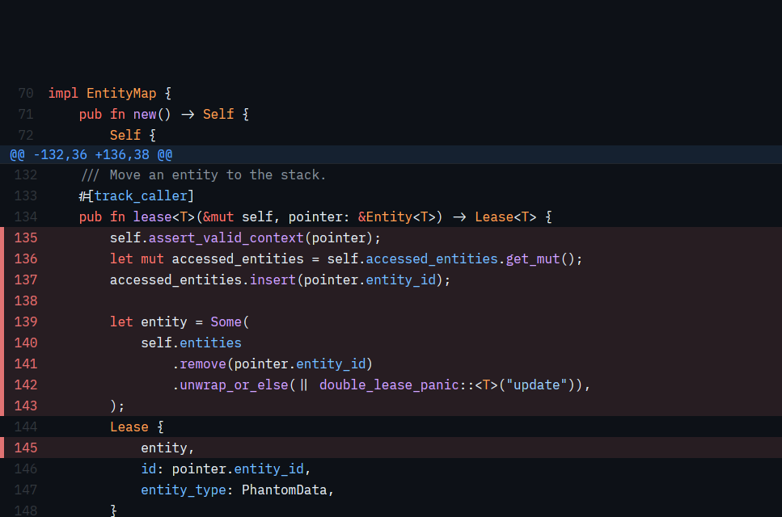
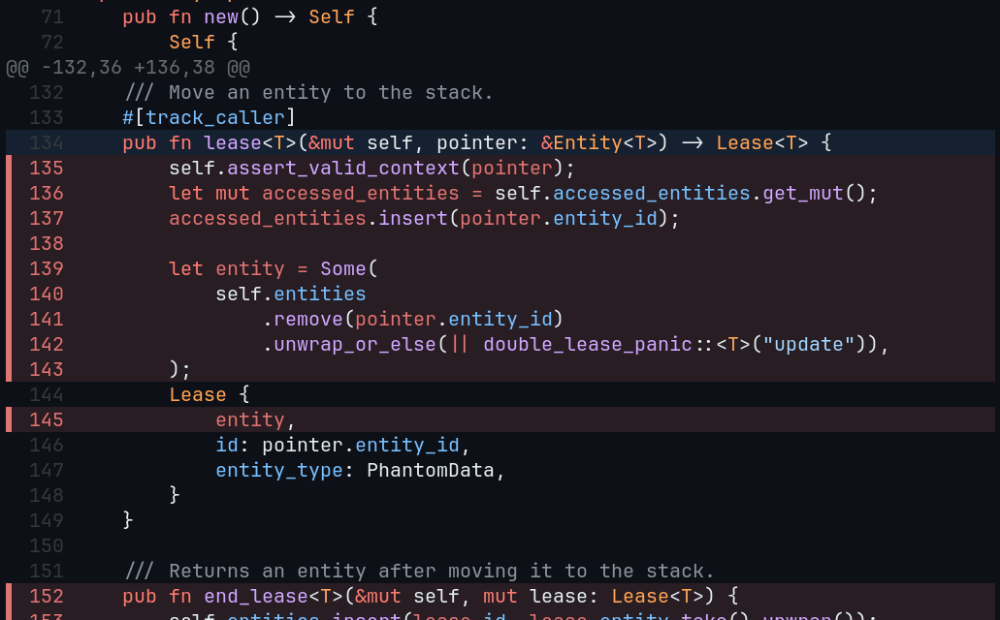

# ClankerDiff

Clankerdiff is a beautiful diff-viewer that lets you send PR-style comments to your coding agent.

### Desktop



### TUI



What makes it special?:

- It's written in Rust (and thus blazing fast!)
- It works across _any_ surface (Terminal, Desktop and Web). 
- It offers AST-powered syntax highlighting and theme support.
- It has vim-style keyboard shortcuts and git commit support built-in

## How do I install it?

For **macOS (Apple Silicon)** and **Linux (x86_64 / ARM64)**:

```sh
curl --proto '=https' --tlsv1.2 -LsSf https://github.com/jcarver989/diff/releases/download/clankerdiff-cli-v0.3.2/clankerdiff-cli-installer.sh | sh
```
Prefer a manual install? Grab a binary from [Releases](https://github.com/jcarver989/diff/releases).

## How do I use it?

You or your agent invoke the `clankerdiff` CLI, it blocks while you review, and when you submit your comments they get written to stdout for your agent. For example:

**Desktop**
```bash
clankerdiff review . --ui desktop --scope both --format json
```

**TUI** 
```bash
CLANKERDIFF_TUI_COMMAND='ghostty +new-window -e' clankerdiff review . --ui tui --tui-placement external --scope both --format json
```

Note: `CLANKERDIFF_TUI_COMMAND` changes based on your terminal of choice. In the example above, this command tells Ghostty to open clankerdiff in a new terminal window.

### As a Skill 

If your harness supports bash interpolation within `SKILL.md` files, you can create a user invocable slash command, e.g. `/diff` that opens Clankerdiff and sends your feedback straight to your agent. For example:

```markdown
---
name: diff
description: Review current changes in the desktop Diff UI and submit feedback
user-invocable: true
agent-invocable: false
---

The user invoked a desktop review of the current workspace changes.

Interpret the review result below:
- changes_requested: address the user's submitted comments.
- approved: acknowledge approval without making additional changes.
- cancelled: do not make changes.
- If the result is missing or invalid, report that no review result was received.
  Do not infer approval or make changes based on missing feedback.

Do not launch another review automatically.

Review result:

!`clankerdiff review . --ui desktop --scope both --format json`
```

If your harness _doesn't_ support this and you're feeling like a sad, jealous panda, checkout [aether](https://aether-agent.io), which is also written in Rust and has clankerdiff built-in.

### Keyboard shortcuts

Select a file, move to a line, and press `c` to add a comment.
When you’re done, press `s` in the diff pane to submit. The agent receives your
comments and addresses them. Press `y` to copy the feedback instead.

| Key | Action |
| --- | --- |
| `↑` / `↓` or `j` / `k` | Navigate |
| `Tab` | Switch between files and diff |
| `c` | Comment on the selected line |
| `e` / `x` | Edit / delete a comment |
| `s` / `y` | Submit / copy feedback (in the diff pane) |
| `t` | Change theme |
| `?` | Show all shortcuts |

To review without an agent, run `clankerdiff review --ui desktop` or
`clankerdiff review --tui-placement current` from your repository.
See `clankerdiff review --help` for all options.
